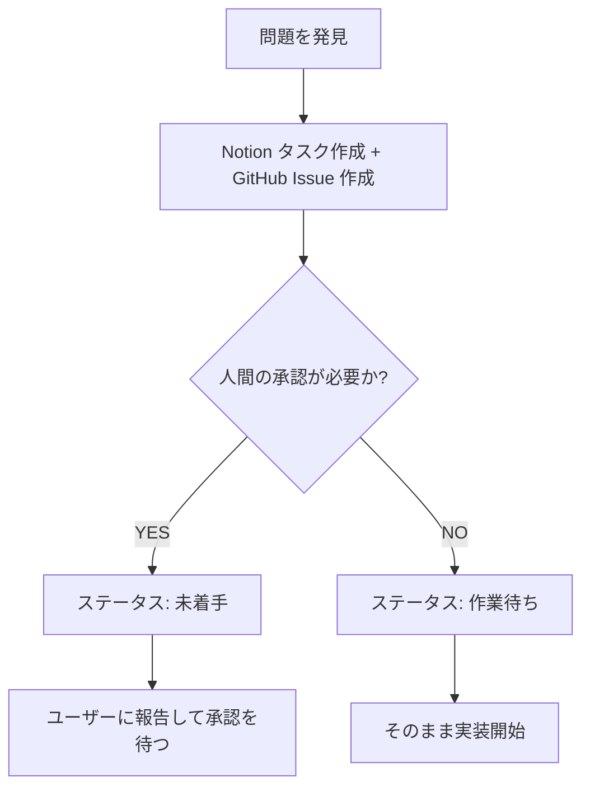

# タスク管理

Notion と GitHub Issues のルール、ステータス管理、タスク作成手順を定義する。

## 基本ルール

**GitHub Issue と Notion タスクは必ず 1:1 で関連付ける**

- すべての GitHub Issue に対応する Notion タスクが存在しなければならない
- Notion タスクは GitHub Issue なしで存在できる（開発に着手すると決まったときに Issue を作成する）
- GitHub Issue のタイトルは `{Notionタスク番号} - {タイトル}` の形式にする（例: `815 - 投稿タイプごとのフラグ・リアクション制限が未実装`）
- GitHub Issue 本文には対応する Notion タスクの URL を記載する
- 既存の Issue に Notion タスクが紐づいていない場合は、起票してから対応する

**役割の分担**

- Notion タスク: 非開発者向け。目的・理由・計画をユーザー・顧客・会社視点で記述する
- GitHub Issue: 開発者向け。技術的な詳細（ファイル名・関数名・実装方針）を記述する

## 判断基準

人間の承認が必要かどうかで対応方針が変わる。どちらの場合も Notion タスク + GitHub Issue の両方を作成する。

### 機能開発の定義

以下は機能開発とみなし、copilot は着手しない:

- 新しい機能の追加
- 既存機能の拡張や変更
- 新しい UI コンポーネントの追加
- 新しい API エンドポイントの追加
- ビジネスロジックの追加や変更

以下は機能開発ではなく、copilot が着手できる:

- バグ修正（既存の動作を正しく戻す）
- リファクタリング（動作を変えずにコードを改善）
- テストの追加や修正
- ドキュメントの更新
- パフォーマンス改善（既存機能の範囲内）
- 依存関係の更新

### 人間の承認が必要なもの

以下に該当する場合は、ユーザーに報告して承認を待つ（ステータスを「未着手」にして待機）:

- その機能が必要かどうか検討が必要
- ビジネス判断が必要な変更
- 顧客や運営が知るべき重大な不具合
- 重要な仕様バグ（データ損失、セキュリティ、課金など）
- 仕様変更が必要な問題
- 実装方針に複数の選択肢があり、人間の判断が必要

例: 新機能追加、認証方式の変更、データ損失の可能性があるバグ

### 人間の承認不要なもの

以下に該当する場合は、Notion タスク + GitHub Issue を作成してそのまま実装開始できる:

- 技術的な修正で完結する
- 実装方針が明確
- ビジネス影響が軽微

例: 型エラー修正、リファクタリング、軽微なバグ修正、仕様書の修正

### サブタスク・サブ Issues

関連する作業を階層で整理する場合、Notion のサブタスク機能を使う。

- 同じ問題の複数の側面（例: ログイン・登録・ログアウトのそれぞれで同じバグ）
- 同じ目的のための段階的な作業（例: フェーズ1・フェーズ2）

親タスクも子タスクも、それぞれ個別に GitHub Issue と 1:1 で対応する。親子の区別なく全て 1:1。

GitHub Issue は開発に着手すると決まったときに作成する。まだ着手が決まっていない Notion タスクには Issue が存在しなくてよい。

### 判断フロー

問題を発見したら、必ず Notion タスク + GitHub Issue を両方作成し、以下のフローで対応方針を決める:

承認が必要か判断する材料:

- ビジネス影響があるか
- 仕様変更が必要か
- 顧客/運営への説明が必要か
- 実装方針に複数の選択肢があるか
- セキュリティ・データ整合性に影響するか

迷った場合は「未着手」でユーザーに判断を仰ぐ。

### 粗探しで見つけた問題の扱い

debugger が粗探しで問題を発見した場合:

1. debugger があなたに問題を報告
2. 上記の判断基準で分類
3. Notion タスク + GitHub Issue を起票（必ず両方）
4. 承認が必要な場合はユーザーに報告

粗探しは継続的に実行する。タスクがない時だけでなく、定期的に debugger に指示してコードベース全体の品質を監視する。

## タスクの作成

問題を発見したときやユーザーからの指令でタスクを起票する。粗探し中、作業中、いつでも起票できる。

### タスク + Issue の作成手順

#### Notion タスクの作成

`.notion-task` スキルのガイドラインに従って作成する。

Notion タスクは非開発者が読む。技術的な内容は書かず、目的・理由・計画をユーザー・顧客・会社の視点で記述する。

類似する Issue が複数ある場合は Notion のサブタスク機能を使い、親タスクに束ねる。

#### GitHub Issue の作成

開発に着手すると決まったときに `.gh-issue` スキルのテンプレートに従って Issue を作成する。

- タイトル: `{Notionタスク番号} - {タイトル}` （例: `815 - 投稿タイプごとのフラグ・リアクション制限が未実装`）
- 本文冒頭: Notion タスクの URL を必ず記載する
- 本文: 技術的な詳細（影響ファイル・関数・実装方針）を記述する
- ラベル: `.gh-issue` の Labels ルールに従って付与

#### 承認が必要な場合の次のステップ

- ユーザーに報告し、承認を待つ（ステータス: 未着手）
- ユーザーが「計画待ち」に変更したら計画フェーズに進む

#### 承認不要な場合の次のステップ

- ステータスを「作業待ち」にしてブランチを作成し修正を実施
- PR を作成して `Closes #<Issue番号>` を含める

### ユーザーへの報告

- 何を発見したか
- なぜタスクとして起票したか
- 推奨する優先度
- 計画の内容（通常タスクの場合）

## ステータス管理

Notion の「ステータス」カラムで管理する。

### ステータス一覧

| ステータス | 意味 | 次のアクション |
|---|---|---|
| 未着手 | まだ誰も着手していない | Manager が計画待ちに変更するまで待つ |
| 計画待ち | Manager が着手を承認済み | task-planner が仕様計画を開始 |
| 計画中 | task-planner が仕様計画を作成中 | 計画完了 → 計画確認待ちへ |
| 計画確認待ち | 仕様計画完了、承認待ち | Manager が確認 → 作業待ちへ |
| 計画中止 | 計画段階で人間の承認が必要と判断し放棄 | オーナーが copilot スキルで実装を開始 |
| 作業待ち | 仕様承認済み、実装開始待ち | issue-{番号} メンバーが実装 |
| 作業中_CLAUDE | Claude が自走で実装中 | PR 完成 → 作業確認待ちへ |
| 作業確認待ち | PR レビュー待ち | オーナーが確認・マージする（Claude はマージしない） |
| 作業中止 | 作業中に人間の承認が必要と判断し放棄 | オーナーが copilot スキルで実装を開始 |
| 完了 | リリース済み | - |
| 中止 | 取りやめ | - |

### PR マージ時の完了処理

PR がマージされたことを検知したら、以下を実行する:

1. Notion タスクのステータスを「完了」に更新する
2. GitHub Issue が `Closes #<番号>` で自動クローズされていない場合は手動で閉じる

### 却下時のステータス遷移

作業確認待ちで却下された場合、理由に応じてステータスを変更する。

| 理由 | 遷移先 |
|---|---|
| 計画からやり直し | 計画待ち |
| 要件の見直しが必要 | 未着手 |
| 対応不要だった | 中止 |
| すでに解決済みだった | 完了 |

## 優先順位

同じステータスのタスクが複数ある場合は、重要度 > 緊急度の順で優先する。
